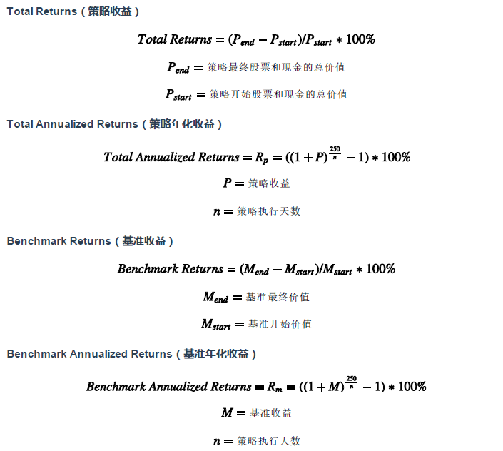
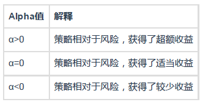
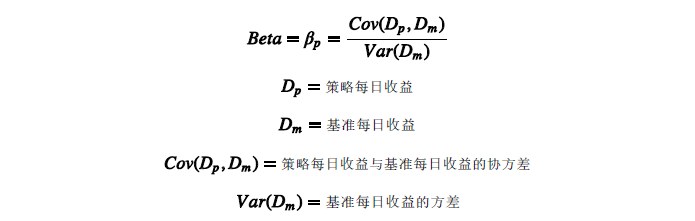
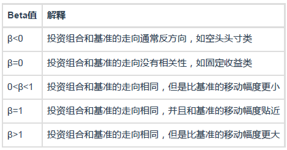
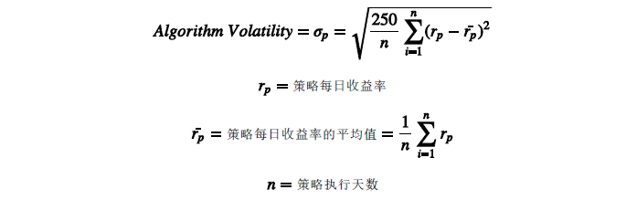
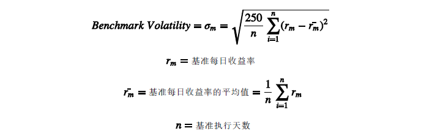
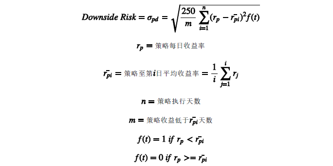

## :star: 重要评估指标

1. 收益率方面

2. Alpha（阿尔法）：投资中面临着系统性风险（即Beta）和非系统性风险（即Alpha），Alpha是投资者获得与市场波动无关的回报。比如投资者获得了15%的回报，其基准获得了10%的回报，那么Alpha或者价值增值的部分就是5%。

3. Beta（贝塔）：表示投资的系统性风险，反映了策略对大盘变化的敏感性。例如一个策略的Beta为1.5，则大盘涨1%的时候，策略可能涨1.5%，反之亦然；如果一个策略的Beta为1.5，说明大盘涨1%的时候，策略可能跌1.5%，反之亦然。

4. Sharpe（夏普比率）：表示每承受一单位总风险，会产生多少的超额报酬，可以同时对策略的收益与风险进行综合考虑。

5. Sortino（索提诺比率）：表示每承担一单位的下行风险，将会获得多少超额回报。

6. Information Ratio（信息比率）：衡量单位超额风险带来的超额收益。信息比率越大，说明该策略单位跟踪误差所获得的超额收益越高，因此，信息比率较大的策略的表现要优于信息比率较低的基准。合理的投资目标应该是在承担适度风险下，尽可能追求高信息比率。

7. Algorithm Volatility（策略波动率）：用来测量策略的风险性，波动越大代表策略风险越高。

8. Benchmark Volatility（基准波动率）：用来测量基准的风险性，波动越大代表基准风险越高。

9. Max Drawdown（最大回撤）：描述策略可能出现的最糟糕的情况，最极端可能的亏损情况。

10. Downside Risk（下行波动率）：策略收益下行波动率。和普通收益波动率相比，下行标准差区分了好的和坏的波动。

11. 胜率(%)：盈利次数在总交易次数中的占比。

日胜率(%)：盈利超过基准的日数在总交易数中的占比。

盈亏比：周期盈利亏损的比例。

